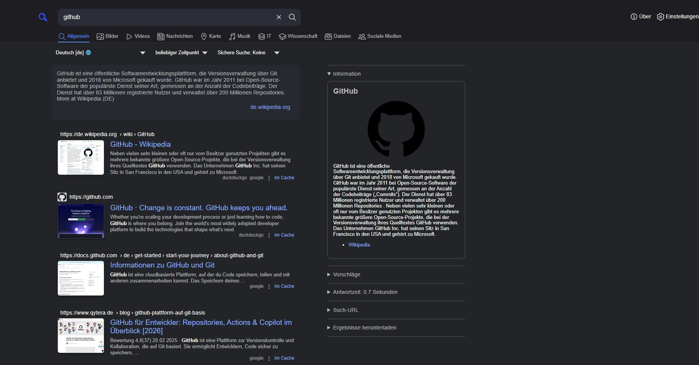
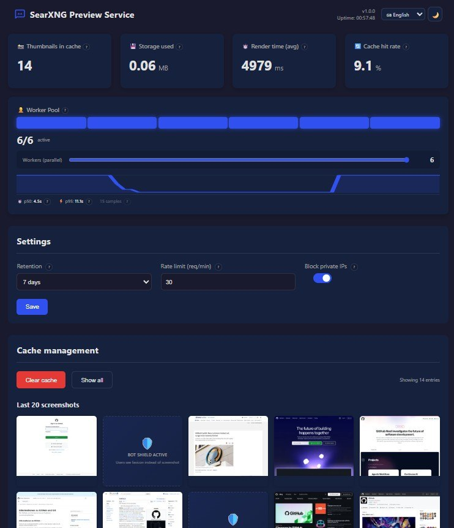

# SearXNG Result Previews 🖼️

> Self-hosted thumbnail previews for your SearXNG search results. No external services, no tracking — just fast screenshots from your own server.



## ✨ Features

- **Thumbnail previews** next to every search result
- **Self-hosted backend** — your URLs never leave your network
- **Admin dashboard** with cache management, worker pool visualization, and live stats
- **Smart detection**: bot-blocked, login-walled, and blank pages fall back to favicons
- **Configurable**: thumbnail position (left/right/hover), size, dark/light theme, DE/EN
- **Browser extension** for Chrome, Edge, Vivaldi, Brave, and other Chromium browsers
- **Privacy-first** — no tracking, no analytics, no external services
- **Lightweight** — no Redis needed, file-based cache with configurable TTL



## 🏗️ Architecture

```
┌─────────────────┐        ┌─────────────────────────┐
│   Browser +     │──────▶ │   Preview Backend       │
│   Extension     │◀────── │   (Docker / Node.js)    │
└─────────────────┘        │                         │
        │                  │  Playwright (Chromium)   │
        ▼                  │  Sharp (image resize)    │
┌─────────────────┐        │  File cache (disk)       │
│   SearXNG       │        │  Worker pool (1-6)       │
│   Search Page   │        └─────────────────────────┘
└─────────────────┘
```

## 📦 Quick Start

### 1. Backend (Docker)

**Option A: Preview Service only** (you already have SearXNG running)

Create a `docker-compose.yml`:

```yaml
services:
  preview-service:
    image: ghcr.io/maikimolto/searxng-previews:latest
    ports:
      - '3200:3000'
    volumes:
      - preview-cache:/app/cache
    environment:
      - CACHE_TTL_HOURS=168
      - RATE_LIMIT_PER_MINUTE=30
      - BLOCK_PRIVATE_IPS=true
      - MAX_CACHE_SIZE_MB=500
    restart: unless-stopped
    deploy:
      resources:
        limits:
          memory: 1G

volumes:
  preview-cache:
```

```bash
docker compose up -d
```

**Option B: Full Stack** (SearXNG + Preview Service together)

Create a `docker-compose.full.yml`:

```yaml
services:
  # ── SearXNG Search Engine ──
  searxng:
    image: searxng/searxng:latest
    container_name: searxng
    restart: unless-stopped
    ports:
      - '8080:8080'
    volumes:
      - searxng-config:/etc/searxng:rw
    environment:
      - TZ=Europe/Berlin
      - SEARXNG_BASE_URL=http://localhost:8080/
      - SEARXNG_SECRET=CHANGE_ME   # ⚠️ openssl rand -hex 32
      - UWSGI_WORKERS=4
      - UWSGI_THREADS=4
    cap_drop:
      - ALL
    cap_add:
      - CHOWN
      - SETGID
      - SETUID
      - DAC_OVERRIDE
    logging:
      driver: json-file
      options:
        max-size: 1m
        max-file: '1'

  # ── Preview Service (Thumbnail Generator) ──
  preview-service:
    image: ghcr.io/maikimolto/searxng-previews:latest
    ports:
      - '3200:3000'
    volumes:
      - preview-cache:/app/cache
    environment:
      - CACHE_TTL_HOURS=168
      - RATE_LIMIT_PER_MINUTE=30
      - BLOCK_PRIVATE_IPS=true
      - MAX_CACHE_SIZE_MB=500
    restart: unless-stopped
    deploy:
      resources:
        limits:
          memory: 1G

volumes:
  searxng-config:
  preview-cache:
```

```bash
docker compose -f docker-compose.full.yml up -d
```

| Service | URL | Description |
|---------|-----|-------------|
| Preview Service | `http://<your-ip>:3200` | Backend + Admin Dashboard |
| SearXNG (full stack only) | `http://<your-ip>:8080` | Search Engine |

### 2. Browser Extension

1. Download the latest `.zip` from the [Releases page](https://github.com/MaikiMolto/searxng-previews/releases)
2. Open `chrome://extensions` (or your browser's equivalent)
3. Enable **Developer mode** (toggle in top-right)
4. Click **"Load unpacked"** and select the extracted extension folder
5. The extension settings will open automatically — enter your backend URL and SearXNG instance URL(s)

> **Note:** The extension requires the self-hosted backend to work. It does not function without it.

## ⚙️ Configuration

### Backend Environment Variables

| Variable | Default | Description |
|----------|---------|-------------|
| `PORT` | `3000` | Backend server port (mapped to 3200 in docker-compose) |
| `CACHE_TTL_HOURS` | `24` | How long thumbnails are cached |
| `MAX_CACHE_SIZE_MB` | `500` | Maximum disk cache size |
| `CONCURRENCY` | `6` | Number of parallel screenshot workers (1-6 in UI, up to 20 via API for multi-user setups) |
| `SCREENSHOT_TIMEOUT` | `15000` | Screenshot timeout in ms |
| `RATE_LIMIT_PER_MINUTE` | `30` | Rate limit per minute (0 = unlimited) |
| `BLOCK_PRIVATE_IPS` | `true` | Block screenshots of private/internal IPs |
| `CORS_ORIGINS` | `*` | Allowed CORS origins |
| `LOG_LEVEL` | `info` | Log level (error, warn, info, debug) |

All settings can also be changed at runtime via the admin dashboard.

### Extension Settings

| Setting | Default | Description |
|---------|---------|-------------|
| **Backend URL** | *(empty)* | URL of your preview backend (e.g. `http://192.0.2.10:3200`) |
| **SearXNG URLs** | *(empty)* | Your SearXNG instance URL(s), one per line |
| **Position** | `Left` | Where the thumbnail appears (Left / Right / Hover / Off) |
| **Size** | `120px` | Thumbnail width in pixels (80-240) |

## 🔒 HTTPS & Reverse Proxy

If your SearXNG instance uses **HTTPS**, the backend must also be served over HTTPS. Otherwise browsers will block the requests (Mixed Content).

**Recommended setup:** Put the backend behind a reverse proxy (nginx, Caddy, Zoraxy, Traefik) with its own hostname:

```
https://previews.example.com  →  http://192.0.2.10:3200
```

**Minimal nginx config:**

```nginx
server {
    listen 443 ssl;
    server_name previews.example.com;

    ssl_certificate     /path/to/cert.pem;
    ssl_certificate_key /path/to/key.pem;

    location / {
        proxy_pass http://192.0.2.10:3200;
        proxy_set_header Host $host;
        proxy_set_header X-Forwarded-For $remote_addr;
        proxy_set_header X-Forwarded-Proto $scheme;
    }
}
```

The extension will detect mixed-content situations and show a clear warning with instructions.

## 🔒 Privacy & Security

- **Self-hosted**: All screenshots are rendered by your own backend — URLs never leave your network
- **No tracking**: Zero analytics, zero telemetry, zero data collection
- **Input validation**: All API inputs are validated (type, range, hex-key patterns)
- **Path traversal protection**: Cache keys are strictly validated against hex patterns
- **Atomic config writes**: Runtime configuration uses write-then-rename to prevent corruption
- **Rate limiting**: Built-in per-minute rate limiting to prevent abuse
- **Open source**: Full transparency — audit every line yourself

## 🛠️ Admin Dashboard

The built-in dashboard at `http://<your-ip>:3200` provides:

- **Live stats**: Cache entries, disk usage, hit rate, render times
- **Worker pool**: Visual slot display, sparkline history, p50/p95 percentiles
- **Cache management**: Browse thumbnails, delete individual entries, clear all
- **Settings**: TTL, rate limit, worker count, private IP blocking
- **Theme**: Dark/light mode, DE/EN language switch

## 🔧 Troubleshooting

### No previews showing
- Check that the backend URL and SearXNG URLs are configured in the extension settings
- Make sure the protocols match: `http://` ≠ `https://` — list both if you use both
- Open browser DevTools (F12 → Console) and look for errors

### Mixed Content warning
- Your SearXNG uses HTTPS but the backend is HTTP
- Solution: Put the backend behind a reverse proxy with HTTPS (see above)

### Previews are slow
- Increase worker count in the dashboard (default: 6, max: 6 in UI)
- First load is always slower — subsequent loads hit the cache
- Some sites have consent banners that add delay

### Some sites show favicons instead of previews
- Bot-blocked sites (Cloudflare, etc.) automatically fall back to favicons
- Login walls and blank pages are detected and handled gracefully

## 🤝 Contributing


## 📄 License

MIT License — see [LICENSE](LICENSE) for details.

## 👥 Credits

**Built by [Maik](https://github.com/MaikiMolto) & Nex** 🤜🤛

Powered by [Playwright](https://playwright.dev/), [Sharp](https://sharp.pixelplumbing.com/), [Fastify](https://fastify.dev/), and way too much coffee.

---

**Need help?** [Open an Issue](https://github.com/MaikiMolto/searxng-previews/issues)
